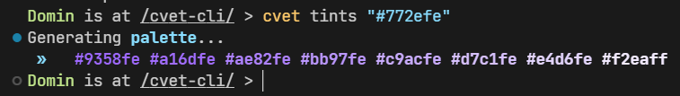
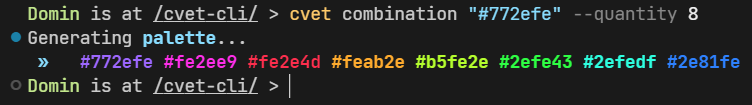
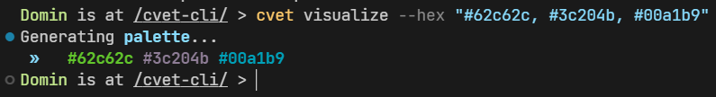

<p align="center">
  
</p>

# Overview

Cvet (Russian word for "color", pronounced `/tsvet/`) is a successor CLI
color tool for customizing and picking colors easily for your projects.
CLI consists of various tools to work with.

# Install

```bash
$ npm i -g @cvet/cli
$ cvet combination "#62C62C" --quantity 8
```

# Usage

A CLI is a minified version of [`cvet`](https://www.npmjs.com/package/cvet)
package therefore it has a limited number of commands to work with:

- `analogous` - Generate a palette of analogous colors.
- `combination` - Generate a palette of color combinations.
- `complementary` - Generate a complementary color - a 180 degrees hue rotated color (opposite).
- `rainbow` - Generate a rainbow of colors (7 colors) from the provided color.
- `shades` - Generate an array of shades from the provided color.
- `square` - Generate a square of colors (4 colors) from the provided color.
- `tints` - Generate an array of tints from the provided color.
- `tones` - Generate an array of tones from the provided color.
- `triade` - Generate a triade of colors (3 colors) from the provided color.
- `visualize` - Visualize an array of provided colors.

Each of those commands require an argument - HEX of the color:



However there are exceptions - `combination`, `shades`, `tints`, `tones` commands that have an
optional flag to provide - `-q`/`--quantity`. This flag defines how many colors
to generate from the palette:



The `visualizer` command on the other hand only requires a single flag - `-h`/`--hex` array separated by commas to visualize colors:



# Documentation

All the available documentation regarding the usage of the CLI is displayed in a help command:

``` bash
$ cvet # or
$ cvet help
```

# Contributing

Pull requests are welcome. For major changes, please open an issue first to discuss what you would like to change.

# License

This project is under [MIT](https://choosealicense.com/licenses/mit/) license. You can freely use it for your own purposes.
